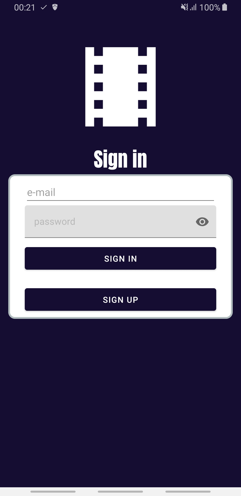
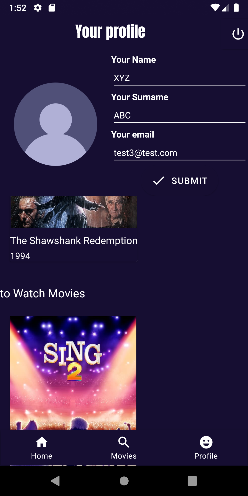
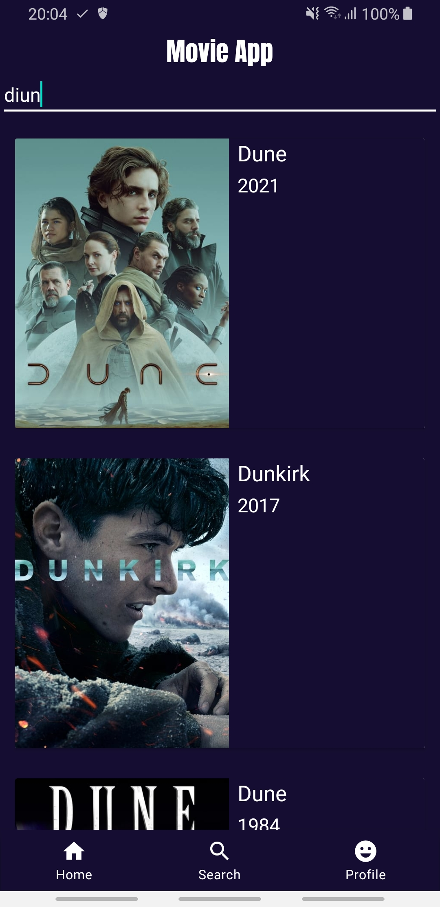
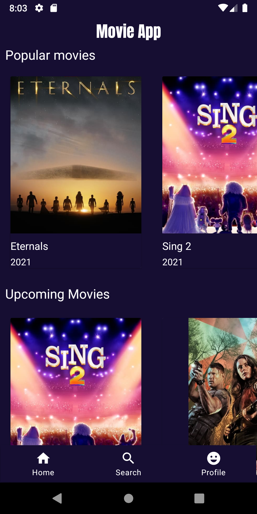
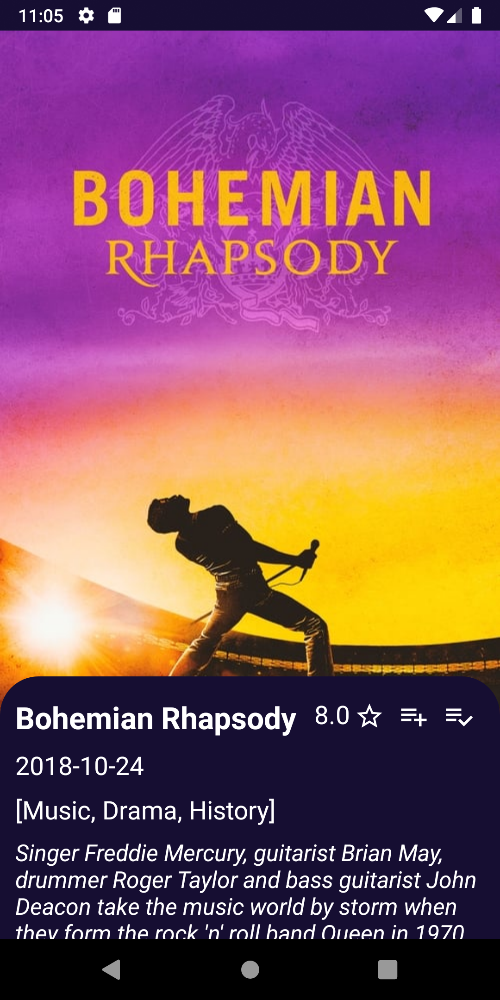

# MovieApp
This is app about filmography. The app is dedicated for movie fans. 

## Functions
* adding movies to the Watchlist, Watchedlist and Favourite Movies List
* searching movies
* scrolling propositions
* creating an account
* checking the movies details

## Used

* The Movie Database API - TMDB API
* Firebase
* Paging Library
* RxJava
* Kotlin Coroutine
* MVVM

## Screenshots

 
 
 
